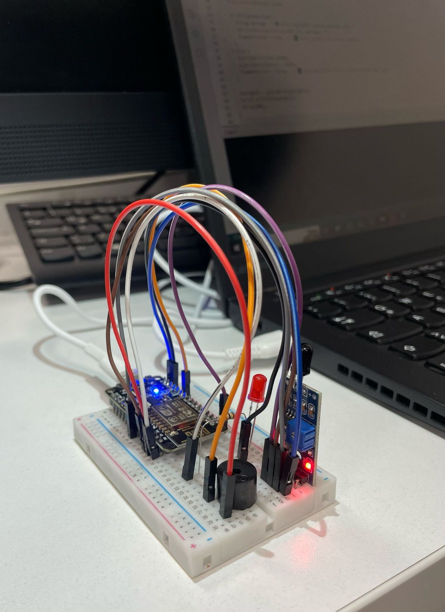

# Ara Rapor

## 1. Proje Konusu 
Bu proje, IR ateş algılama sensörü kullanarak alev tespitini sağlayan ve tespit edilen durumlarda hem fiziksel (LED ve buzzer) hem de dijital (Telegram botu üzerinden bildirim) uyarı sistemlerini devreye sokan bir erken uyarı sistemidir.

## 2. Özet 
Projenin ilk aşamasında donanım bağlantıları yapılarak IR sensör devreye alındı. Alev algılandığında LED ışık ve buzzer ile fiziksel uyarı sisteminin başarılı şekilde çalışması sağlandı. ESP8266 bağlantısı ve Telegram entegrasyonu üzerinde çalışmalara başlanmıştır.

## 3. Kullanılan Yöntemler

Projenin bu aşamasına kadar aşağıdaki yöntem ve teknolojiler kullanılmıştır:

### Donanımsal Yöntemler:
- **IR Alev Algılama Sensörü:** Ortamdaki alevin varlığını tespit etmek için kullanılmıştır. Bu sensör, alevin yaydığı kızılötesi ışınımı algılayarak dijital sinyal üretir.
- **LED (Işık Kaynağı):** Fiziksel uyarı mekanizmasının bir parçası olarak kullanılmıştır. Alev tespit edildiğinde yanarak kullanıcıyı görsel olarak uyarır.
- **Buzzer (Sesli Uyarı):** Alev algılandığında sesli uyarı vererek dikkat çekici bir alarm görevi görür.
- **ESP8266 Wi-Fi Modülü:** Sistemin internete bağlanmasını sağlar. İlerleyen aşamada Telegram üzerinden dijital bildirim göndermek için kullanılacaktır.
- **Breadboard ve Bağlantı Kabloları:** Devre elemanlarının geçici olarak monte edilmesi ve test edilmesi için kullanılmıştır. Kolay bağlantı değişikliklerine olanak tanır.

### Yazılımsal Yöntemler:
- **Arduino IDE:** Tüm sistemin kontrolünü sağlayan yazılım burada geliştirilmiştir. ESP8266 ile haberleşme, sensör verisi okuma ve fiziksel uyarı çıktıları bu ortamda yazılmıştır.
- **Telegram Bot API:** Projenin dijital uyarı sistemini oluşturmak için kullanılmaktadır. ESP8266 üzerinden, kullanıcıya doğrudan Telegram uygulaması aracılığıyla bildirim gönderilmesi amaçlanmaktadır.
- **C++ Programlama Dili:** Arduino ortamında yazılım geliştirme için kullanılan dildir. Kodlar donanımı doğrudan kontrol edebilecek şekilde yazılmıştır.

### Metodolojik Yaklaşımlar:
- **Modüler Tasarım:** Sistem, fiziksel ve dijital uyarı bölümleri olarak iki ana modüle ayrılmıştır. Böylece her bir bölüm bağımsız olarak test edilebilmiş ve hatalar kolaylıkla izole edilmiştir.
- **Test ve Doğrulama:** IR sensörün doğruluğu çeşitli koşullarda test edilmiştir. Fiziksel uyarılar ayrı ayrı doğrulanarak sistemin güvenilirliği artırılmıştır.
- **Adım Adım Geliştirme:** Proje, önce fiziksel devre kurulumu ve testleri ile başlatılmış, ardından yazılım geliştirme ve entegrasyon aşamalarına geçilmiştir. Bu yöntem, hata ayıklamayı kolaylaştırmıştır.

## 4. Yapılan Çalışmalar ve Görselleri
- IR sensör, LED ve buzzer bağlantıları breadboard üzerinde kuruldu.
- Arduino kodları yazılarak alev algılandığında LED ve buzzer’ın çalışması sağlandı.
- Proje devresi başarıyla test edildi.
  

> Şekil 1: Kurulan IR sensörlü erken uyarı sistemi devresi.

## 5. Elde Edilen Sonuçlar
- Alev algılandığında LED’in yanması ve buzzer’ın ötmesi başarıyla sağlandı.
- Fiziksel uyarı mekanizması sorunsuz çalışmaktadır.
- ESP8266 bağlantısı sağlanmış, Telegram bildirim sistemi kurulum aşamasındadır.

## 6. Karşılaşılan Sorunlar ve Çözümler
| Sorun | Çözüm |
|-------------------------------|--------------------------------------------------------------|
| Sensörün doğru algılamama durumları | Sensörün konumlandırılması ve ortam ışığı etkileri test edilerek düzenlendi. |
| ESP8266 bağlantı sorunları | Arduino IDE’ye uygun kütüphaneler eklendi, bağlantı parametreleri gözden geçirildi. |

## 7. Projenin Devamında Yapılacaklar
- ESP8266 üzerinden Telegram botuna başarılı şekilde bildirim gönderilmesi sağlanacak.
- Proje kutulanarak taşınabilir hale getirilecek.
- Tüm bileşenler optimize edilerek nihai rapor ve sunum hazırlanacak.
- Güç kaynağı ile bağımsız çalışabilirlik, ilerleyen aşamalarda harici batarya kullanılarak test edilecektir.

Güç Bağımsızlığı Testi: Sistem, dış ortamlarda veya elektrik kesintisi yaşanabilecek alanlarda da kesintisiz çalışabilmesi amacıyla harici batarya gibi alternatif güç kaynaklarıyla test edilecektir. Bu test, projenin daha sonraki aşamalarında gerçekleştirilecek olup uzun süreli çalışabilirlik ve enerji verimliliği açısından değerlendirme yapılacaktır.

