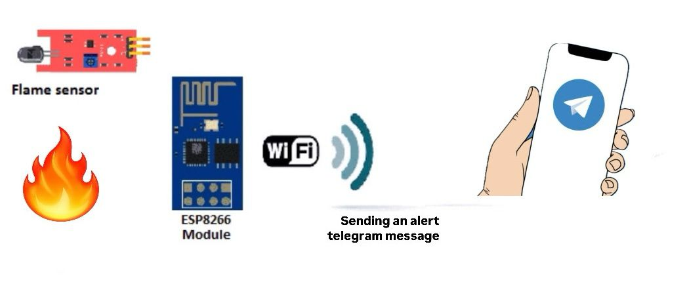

# FireSense: IoT Tabanlı Akıllı Alev Algılama ve Uyarı Sistemi

## 1. Proje Konusu 
Bu proje, IR ateş algılama sensörü ile alev tespit ederek LED veya alarm ile fiziksel uyarı veren, aynı zamanda Telegram API aracılığıyla anlık bildirim gönderen bir güvenlik sistemidir.  

## 2. Proje Kısa Özeti
- **ESP8266** kullanarak Wi-Fi bağlantısı sağlanır.  
- **IR Ateş Algılama Sensörü** alevi algılar ve ESP8266’ya sinyal gönderir.  
- **LED ve/veya Alarm**, fiziksel uyarı sağlar.  
- **Telegram API** ile belirlenen kullanıcıya "Flame Detected!" mesajı gönderilir.

  

ESP8266 ve IR alev sensörü kullanarak yangınları tespit eden ve Wi-Fi üzerinden anlık bildirim gönderen akıllı bir sistemdir. Alev algılandığında, buzzer ve LED ile uyarı verilir ve Telegram botu aracılığıyla kullanıcılara "Flame Detected" mesajı gönderilir.

  

## 3. Proje Gereksinimleri
Projeyi çalıştırmak için aşağıdaki bileşenlere ihtiyaç vardır:  
- **IR Ateş Algılama Sensörü** (Alev tespiti)  
- **LED / Alarm** (Fiziksel uyarı)  
- **ESP8266** (Wi-Fi bağlantısı)  
- **Bağlantı Kabloları**  
- **Breadboard**
- **Arduino IDE**
- **USB Kablo (ESP8266'yı programlamak için)**

## 4. Projeyi Çalıştırma 
1. Arduino IDE'yi açın ve ESP8266 için uygun kütüphaneleri yükleyin.
2. IR sensörünü ESP8266'ya bağlayın.
3. LED ve/veya alarmı ESP8266'ya bağlayın.
4. Telegram botu oluşturun ve API token'ını alın.
5. Proje kodunu Arduino IDE ile ESP8266'ya yükleyin.
6. ESP8266'yı Wi-Fi ağına bağlayın ve Telegram botu üzerinden bildirimleri test edin.

   

## 5. Proje Lisans Bilgileri
Bu proje, MIT Lisansı altında sunulmaktadır. Daha fazla bilgi için [LICENSE](LICENSE)
 dosyasına göz atabilirsiniz.
## 6. Proje Anahtar Kelimeleri
IoT, ESP8266, Fire Detection, IR Sensor, Telegram API, IoT, Security System

